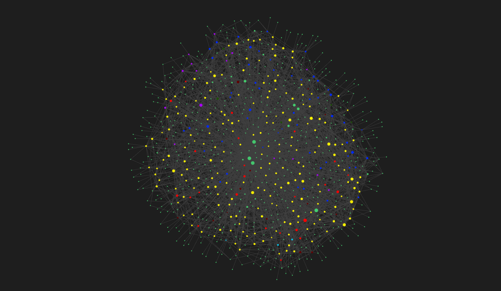

# grandplan

> A native **Windows, fully-offline** "second brain": select text in *any* app → capture it with a
> global hotkey → a **local LLM** organizes it into a clean, atomic note (your original preserved
> **verbatim**) → you approve → it's written as a well-linked, de-duplicated Markdown note into your
> **Obsidian vault**, and projects into an **actionable plan**.

<p align="center">
  
</p>
<p align="center"><em>The vault as a knowledge graph — notes captured from anywhere, auto-linked into a navigable web.</em></p>

**Status:** working offline core. The platform-agnostic capture → organize → vault → plan
pipeline is built and gated (870 passing tests, runnable from the CLI); the local-LLM (Ollama)
organizer and the Windows global-hotkey capture/GUI are implemented as environment-gated
adapters. Nothing leaves your machine.

## Why

Notes are scattered across email, Notepad, Docs, paper, and phones. Existing tools either make you
organize manually or only *search* what you already wrote. grandplan captures from anywhere, organizes
losslessly with local AI, and keeps a **clean, connected** vault — never a second jumbled mess.

See **[SPEC.md](./SPEC.md)** (requirements) and **[RESEARCH.md](./RESEARCH.md)** (prior art, techniques,
feasibility) for the full picture, and **[docs/adr/](./docs/adr/)** for architecture decisions.

## Architecture (ports & adapters)

A platform-agnostic **core** (segment · preserve-verbatim · organize · embed · link · dedup · project)
depends only on **ports** (`Capturer`, `Organizer`, `Embedder`, `Repository`, `VaultWriter`, `Planner`).
Windows-only **adapters** (global-hotkey capture, local LLM runtime, the Obsidian vault) implement those
ports. The core is fully unit-testable and is the part the quality gate governs.

- **Core** — pure Python, no Windows/LLM/UI deps. Developed & gated here (works under WSL2).
- **Adapters** — thin Windows implementations; integration-tested on Windows.
- **Store** — the Obsidian vault (Markdown, source of truth) + an internal SQLite index (embeddings, edges).

## Constraints (non-negotiable)

- **Offline only** — zero network egress.
- **Lossless** — every original captured selection is preserved byte-for-byte; never mutated.
- **Modest hardware** — runs on a 16GB-RAM machine, no dedicated GPU.

## Security model

grandplan is a **single-user, local-trust** tool — the capture surfaces assume the local machine and
its user are trusted:

- **HTTP intake** (`grandplan serve` / `up`) **binds `127.0.0.1` by default** and is then reachable by
  any local process: there is **no authentication on localhost** (intentional for the desktop model).
  Every request body is capped at **1 MiB** and rejected *before* it is read if it is oversized,
  malformed, or — when a token is set — unauthorized.
- **Exposing it on a LAN** (a routable `--host`, e.g. a phone shortcut) **requires a shared secret** —
  the server refuses to start on a non-localhost host without one. Provide it via the **`GRANDPLAN_TOKEN`
  env var** (preferred — keeps it out of `ps` / `/proc`) or `--token`, sent as `Authorization: Bearer <token>`.
- An intake request's optional `prompt` becomes the **instruction** an MCP-connected agent later runs,
  and captured text is fed verbatim to the local LLM — so treat the prompt and note content as a trust
  boundary, and only expose the port to callers you trust.
- Captured originals are stored **unencrypted** as JSONL under `~/.grandplan/` (or `GRANDPLAN_HOME`).

Nothing is fetched and nothing leaves the machine; this is about *local* process trust, not network exposure.

## Quality gate (borromeo)

This repo is governed by [borromeo](https://github.com/3MagicLabs/borromeo). Nothing is "done" until the
gate is green. Run it locally:

```bash
/path/to/borromeo/verify.sh        # build · hygiene · format · lint · typecheck · test+coverage · security
```

CI (`.github/workflows/ci.yml`) **mirrors** the borromeo gate so pull requests are checked automatically.

## Run it (offline core, any platform)

The full offline core loop is runnable today — turn a messy text file into an Obsidian-style
vault with a knowledge graph and a generated plan:

```bash
PYTHONPATH=src python3 -m grandplan organize notes.txt -o my-vault
# or, after `pip install -e .`:
grandplan organize notes.txt -o my-vault
```

It splits the file into notes, organizes each (title/type/tags), links related ones, skips
near-duplicates, and writes `my-vault/*.md` + `graph.json` + `Plan.md`. Fully offline; no LLM
required. Add `--llm` / `--embeddings` to use a local Ollama model + local embeddings where
installed. The Windows global-capture / GUI adapters are separate (see SPEC §6 / ADR-0003).

**On Windows** (real local AI + building the capture/GUI adapters): see [docs/WINDOWS.md](./docs/WINDOWS.md).

## Development

- Dev/test the **core** in this Linux/WSL2 environment (Python + ruff/mypy/pytest/bandit).
- The **Windows adapters** (capture, GUI, LLM runtime) run/integration-test on Windows.
- Reproducible test image: `docker build -t grandplan-dev . && docker run --rm grandplan-dev`.

See **[CONTRIBUTING.md](./CONTRIBUTING.md)**.

## License

[Apache 2.0](./LICENSE).
